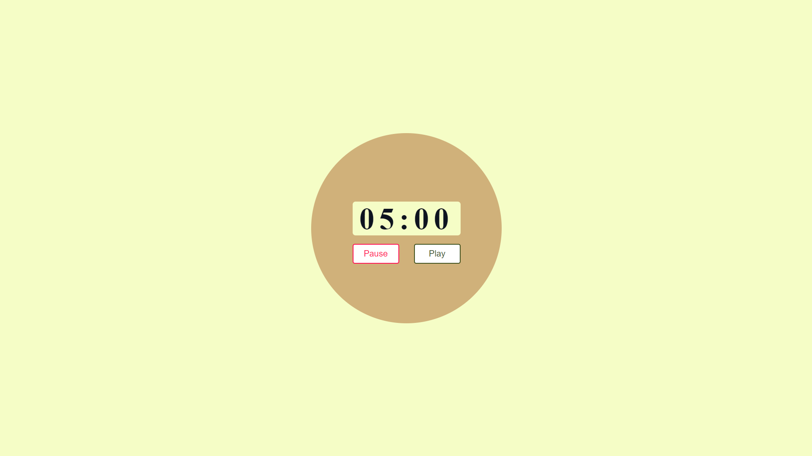
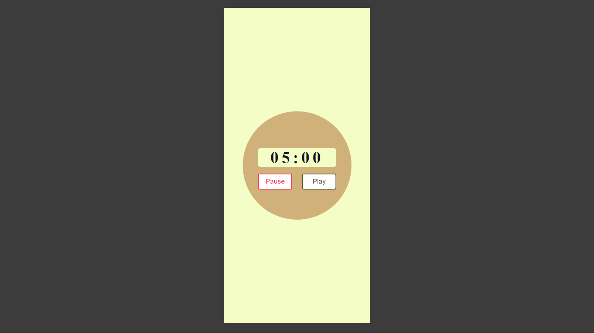

# JavaScript Timer



This is a simple countdown timer built using HTML, CSS, and JavaScript. The timer starts from a preset time (5 minutes in this case) and counts down to zero. The user can pause and resume the countdown as needed.

## Features

- **Responsive Design**: The timer adjusts to different screen sizes.
- **Play/Pause Functionality**: The timer can be paused and resumed at any time.
- **Alert Notification**: An alert is displayed when the timer reaches zero.

## How to Use

1. Clone the repository:

   ```bash
   git clone https://github.com/Iqbolshoh/javascript-timer.git
   ```

2. Navigate to the project directory:

   ```bash
   cd javascript-timer
   ```

3. Open `index.html` in your web browser:

   ```bash
   open index.html
   ```

4. The timer will start at 5 minutes. You can pause and resume using the "Pause" and "Play" buttons.

## Project Structure

- `index.html`: The main HTML file.
- `styles.css`: The CSS file for styling the timer.
- `script.js`: The JavaScript file that controls the timer functionality.
- `images/banner.png`: The banner image for the project.
- `images/mobile.png`: A screenshot showing the timer on a mobile device.

## Technologies

<div style="display: flex; flex-wrap: wrap; gap: 5px;">
    
    
    
</div>

## Screenshots

### Desktop View


### Mobile View


## Connect with Me

I love connecting with new people and exploring new opportunities. Feel free to reach out to me through any of the
platforms below:

<table>
    <tr>
        <td>
            <a href="https://t.me/iqbolshoh_777">
                
            </a>
        </td>
        <td>
            <a href="https://instagram.com/iqbolshoh_777" target="blank"></a>
        </td>
        <td>
            <a href="https://wa.me/qr/22PVFQSMQQX4F1">
                
            </a>
        </td>
        <td>
            <a href="https://x.com/iqbolshoh_777">
                
            </a>
        </td>
        <td>
            <a href="https://www.linkedin.com/in/iqbolshoh/">
                
            </a>
        </td>
        <td>
            <a href="mailto:iilhomjonov777@gmail.com">
                
            </a>
        </td>
    </tr>
</table>
